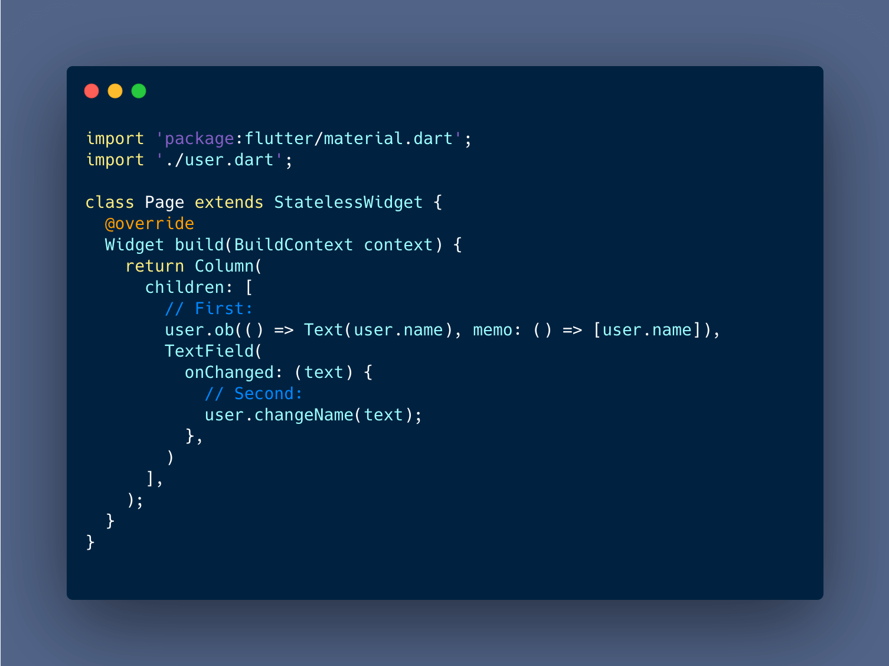

- [English Document](./README.md)
- [中文文档](./README-CN.md)

# [Oboe](https://pub.dev/packages/oboe) 优雅地状态管理库

Oboe 从名字到使用方式，处处都显露着优雅，它的说明仅仅需要两张截图：




## 特性

- Oboe 不需要顶部包裹.
- Oboe 使用 memo 来拦截不必要的更新，就像 `React.useMemo`.
- Oboe 非常易于使用，仅有两个 API: `ob`, `next`

### 安装 Oboe

编辑 `pubspec.yaml`:

```yaml
dependencies:
  oboe:
```

## 整体解释

实例一个 user 对象，继承于 Oboe

```dart
// Definition Oboe
class User extends Oboe {
  String name = "dog";
}

// Instance, use some widgets
var user = User();
```

订阅一个更新：

```dart
user.ob(()=>Text(user.name))
```

派发所有 user.ob 的订阅更新

```dart
user.next()
```


## 更好的性能

使用 `memo` 是可选的，就像 `React.useMemo` 仅仅当数组中的对象有变化才会更新.

仅当 `user.name` 改变时，才会更新的例子:

```dart
user.ob(
  () => Text(user.name), 
  memo: ()=>[user.name],
);
```

这就可以用起来了，这就是所有。