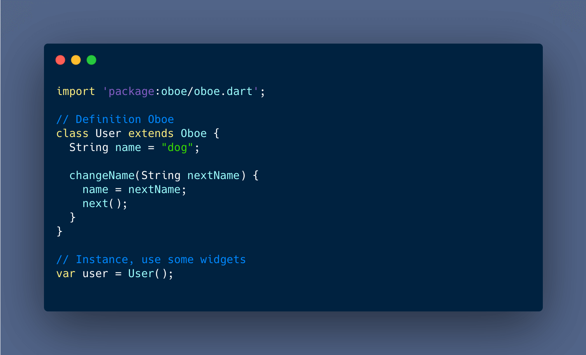
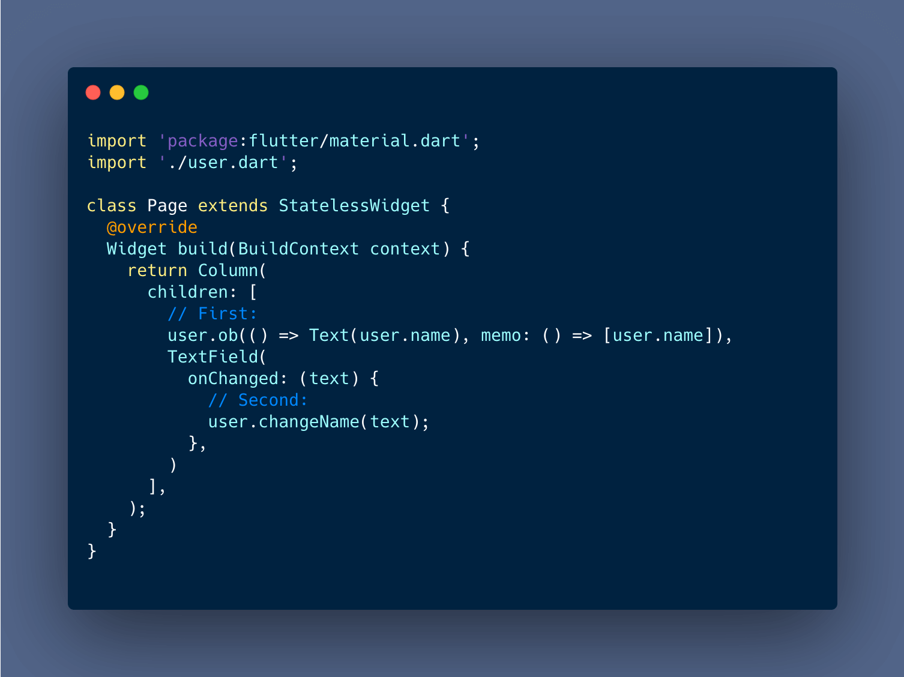

# 🎺 [Oboe](https://pub.dev/packages/oboe) - Elegant state management library


- [English Document](./README.md)
- [中文文档](./README-CN.md)

Oboe is elegant from the name to the way it is used. Its description only needs two screenshots






## Feature

- Oboe not need Provider at root Widget.
- Oboe use `memo` to intercept update, like react.Hooks.
- Oboe is tiny and ease use, only 2 API: `ob`, `next`

### Install Oboe

Change `pubspec.yaml`:

```yaml
dependencies:
  oboe:
```

## Overall interpretation

Instance a `user`，extends `Oboe`:

```dart
// Definition Oboe
class User extends Oboe {
  String name = "dog";
}

// Instance, use some widgets
var user = User();
```

Subscribe and return a weight:

```dart
user.ob(()=>Text(user.name))
```

Submit and update user.ob's subscribe:

```dart
user.next()
```


## Better performance


Use `memo` options params, like `React.useMemo`, only rerender data in memo array.

Example only rerender when user.name change:

```dart
user.ob(
  () => Text(user.name), 
  memo: ()=>[user.name],
);
```

## Thanks

That all, keep sample :)